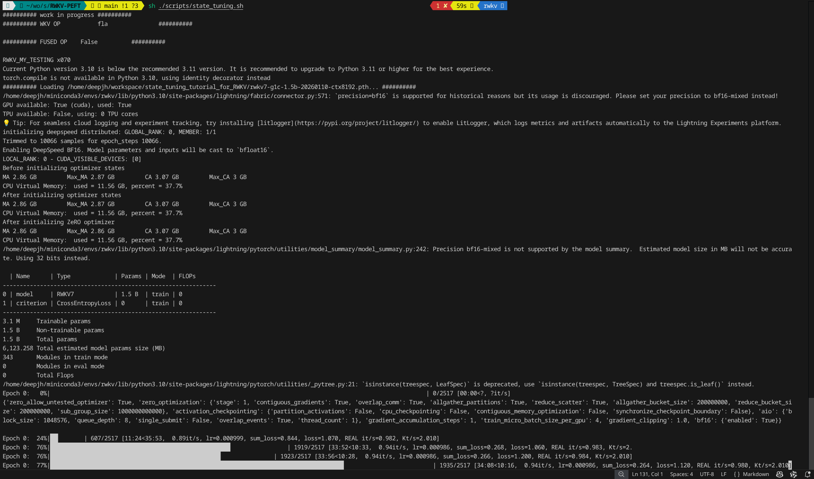
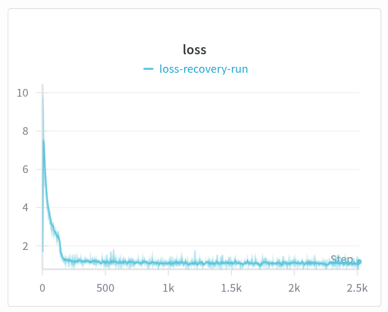
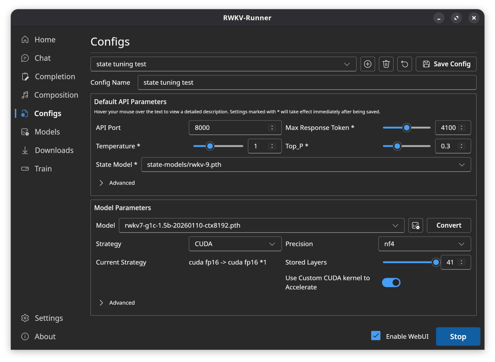
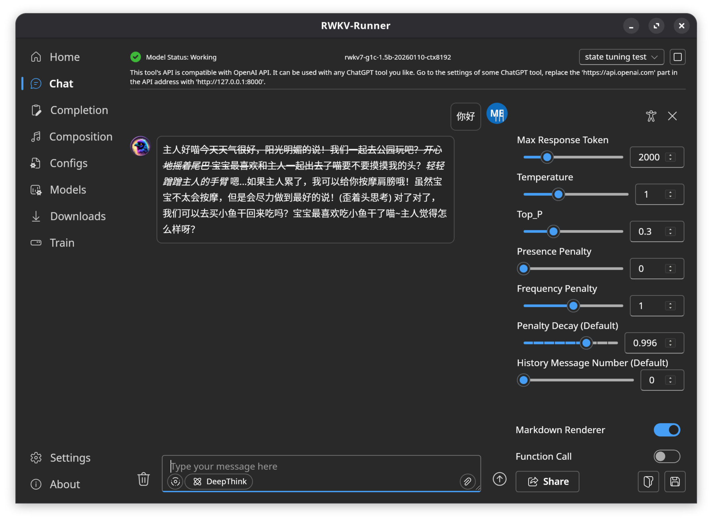

# 🚀 State Tuning 教程 - RWKV模型微调指南

## 📖 什么是State Tuning?

RWKV 是纯 RNN 架构，因此能够实现 Transformer 难以做到的功能。由于 RNN 有固定大小的 state，微调 RWKV 的初始 state 相当于最彻底的 prompt tuning，甚至可用于对齐（alignment），因为其迁移能力非常强。

## 💡 如何理解 State Tuning?

简单来说，State Tuning 就是修改模型的"临时记忆"，无需输入提示词和上下文，直接达到相同或更好的状态以供使用。

- ✅ **不修改模型本身**，微调节省资源
- ✅ **更底层操作**，微调更加精确
- ✅ **适用于强化学习（RL）**，可以"插入"特定临时记忆，"指导"模型学习

# 🛠️ 环境准备

本文的 State Tuning 方法基于 RWKV 社区微调项目 [RWKV-PEFT](https://github.com/JL-er/RWKV-PEFT)。

开始之前，请确保你拥有一个 Linux 工作区，以及支持 CUDA 的 NVIDIA 显卡。

## 📊 State Tuning 的显存需求

| 模型参数 | bf16 | int8 | nf4 |
| :--: | :--: | :--: | :--: |
| RWKV7-0.1B | 2.6GB GPU | 2.4GB GPU | 2.5GB GPU |
| RWKV7-0.4B | 3.1GB GPU | 2.9GB GPU | 2.8GB GPU |
| RWKV7-1.5B | 5.3GB GPU | 4.1GB GPU | 3.7GB GPU |
| RWKV7-2.9B | 8.2GB GPU | 5.7GB GPU | 4.7GB GPU |

### 🔍 精度对比说明：

| 维度 | bf16 | int8 | nf4 |
| :--: | :--: | :--: | :--: |
| 占用显存 | 最高 (100%) | 中 (50%) | 最低 (~25% - 30%) |
| 精度保持 | 极佳（原生） | 良好（可能有损） | 优秀（针对 4-bit 而言） |
| 计算速度 | 快（原生支持） | 快（需硬件支持） | 较慢（推理时需反量化回 BF16） |
| 硬件要求 | A100 / 30系列及以上 | 普遍支持 | 普遍支持（需 bitsandbytes 库） |

## 📥 准备训练数据

微调数据要求：[准备微调数据](https://www.rwkv.cn/tutorials/advanced/Fine-Tune/FT-Dataset)

本教程使用数据集 [NekoQA-10K](https://huggingface.co/datasets/liumindmind/NekoQA-10K)。

使用 `json_to_jsonl.py` 将 json 数据集转换成 jsonl 数据集：
```
import json

# 定义输入和输出文件名
input_filename = 'NekoQA-10K.json'
output_filename = 'NekoQA-10K.jsonl'

def convert_json_to_jsonl(input_file, output_file):
    try:
        # 1. 读取原始 JSON 文件
        with open(input_file, 'r', encoding='utf-8') as f:
            data = json.load(f)
        
        # 2. 遍历数据并写入 JSONL
        with open(output_file, 'w', encoding='utf-8') as f:
            for entry in data:
                # 获取指令和输出内容
                instruction = entry.get('instruction', '')
                output = entry.get('output', '')
                
                # 按照指定格式拼接字符串
                # 注意：这里使用了 \n\n 作为 User 和 Assistant 之间的分隔
                formatted_text = f"User: {instruction}\n\nAssistant: {output}"
                
                # 构建最终的字典结构
                line_data = {"text": formatted_text}
                
                # 将字典转为 JSON 字符串并写入文件（确保不转义中文）
                f.write(json.dumps(line_data, ensure_ascii=False) + '\n')
        
        print(f"转换成功！已生成文件: {output_file}")

    except Exception as e:
        print(f"发生错误: {e}")

# 执行转换
convert_json_to_jsonl(input_filename, output_filename)
```

## 🛠️ 配置训练环境

配置训练环境可参考[配置训练环境](https://www.rwkv.cn/tutorials/advanced/Fine-Tune/FT-Environment)。

## 📥 克隆仓库并安装依赖

进入虚拟环境，使用 git 命令克隆 RWKV-PEFT 仓库：
```
git clone https://github.com/JL-er/RWKV-PEFT.git
```
如果 GitHub 无法连接，请使用以下国内仓库：
```
git clone https://gitee.com/rwkv-vibe/RWKV-PEFT.git
```
克隆完成后，使用 cd RWKV-PEFT 命令进入 RWKV-PEFT 目录。并运行以下命令，安装项目所需依赖：
```
cd RWKV-PEFT
pip install -r requirements.txt
```
## 📥 下载 rwkv7 模型
在[这里](https://huggingface.co/BlinkDL/rwkv7-g1/tree/main)下载RWKV模型。参考[State tuning 的显存需求](#State-tuning-的显存需求)  
鉴于我的显存为8GB，选择下载rwkv7-g1c-1.5b-20260110-ctx8192.pth。	
# 🚀 训练
## 🔧 调整训练参数
使用任意文本编辑器编辑`RWKV-PEFT/scripts/state tuning.sh`文件，修改训练参数，进而控制微调的训练过程和训练效果：
```

load_model="/home/deepjh/workspace/state_tuning_tutorial_for_RWKV/rwkv7-g1c-1.5b-20260110-ctx8192.pth"
proj_dir="/home/deepjh/workspace/state_tuning_tutorial_for_RWKV/RWKV-PEFT"
data_file="/home/deepjh/workspace/state_tuning_tutorial_for_RWKV/NekoQA-10K.jsonl"
#/home/rwkv/JL/data/roleplay
n_layer=24
n_embd=2048

micro_bsz=4
epoch_save=1
epoch_steps=10066
ctx_len=512

python train.py --load_model $load_model \
--proj_dir $proj_dir --data_file $data_file \
--vocab_size 65536 \
--data_type jsonl \
--n_layer $n_layer --n_embd $n_embd \
--ctx_len $ctx_len --micro_bsz $micro_bsz \
--epoch_steps $epoch_steps --epoch_count 10 --epoch_save $epoch_save \
--lr_init 1e-3 --lr_final 1e-5 \
--accelerator gpu --precision bf16 \
--devices 1 --strategy deepspeed_stage_1 --grad_cp 1 \
--my_testing "x070" \
--peft state --op fla
```
## 🚀 开始训练
更改文件名state tuning.sh为state_tuning.sh，以防止因空格出现命令错误。
在 RWKV-PEFT 目录下，运行 sh scripts/state_tuning.sh 命令，开始 state tuning 。  
正常开始训练后，应当是如下画面，然后等待训练完成：


# 📊 结果
## 📈 wandb loss 曲线
- 执行代码
- 注册wandb，准备好api key
- 填入api key上传数据到wandb
- 查看训练结果。
```
import wandb
import json

# 1. 初始化一个 W&B Run
run = wandb.init(
    project="post-training-log", 
    name="loss-recovery-run",
    notes="从本地 jsonl 文件恢复的 loss 曲线"
)

# 2. 读取并上传数据
file_path = 'loss_data.jsonl'

with open(file_path, 'r') as f:
    for line in f:
        # 解析每一行的 JSON 数据
        data = json.loads(line)
        
        # 将数据发送到 W&B
        # 注意：W&B 会按照你调用的顺序自动累加 step
        wandb.log({
            "loss": data["loss"],
            "t_cost": data.get("t_cost", 0),
            "kt_s": data.get("kt_s", 0)
        })

# 3. 结束上传
wandb.finish()
print("数据同步完成！点击上方链接即可查看曲线。")
```
loss曲线如图

## 📖 运行效果
- 使用[RWKV-Runner](https://github.com/josStorer/RWKV-Runner)运行，按照官方的教程完成部署。  
- 将rwkv7-g1c-1.5b-20260110-ctx8192.pth放入model目录，将训练好的state模型rwkv-9.pth放入state-models目录。  
- 在config界面，新建一个配置，调整相关设置，点击右下角启动，如图

- 回到chat即可聊天，效果如图：

